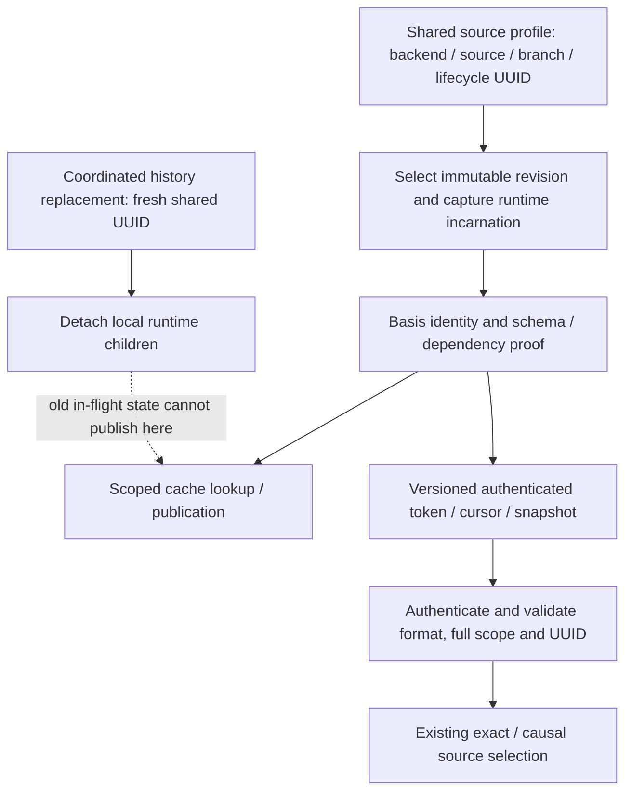

## Context

See [proposal.md](proposal.md) for motivation and the operator-selected breaking upgrade policy. These artifacts define the reviewed implementation and its remaining qualification obligations. Implementation does not imply release qualification; incomplete or failed gates remain explicit in the checklist and ignored evidence directory.

The inspected code has three distinct identities that must not be conflated:

| Identity | Current responsibility | Treatment here |
| --- | --- | --- |
| Backend/source ID/branch | Identifies a database history and its scope | Preserve existing backend-specific domain |
| Public source lifecycle | Names an incarnation in tokens, provenance and runtime lineage | Narrow to a native UUID |
| Private runtime incarnation | Detaches old local cache children and retained publication authority | Preserve process-private identity and rotation |

Native revision/exact locator and schema/relation generations remain separate. A UUID lifecycle is not freshness evidence, a replacement for authorization, a session revocation fence, or an ordering counter.

Pre-change source inventory (paths relative to this repository; the implementation matrix below records the upgraded state):

- [causal_token.cljc](../../../modules/eacl/src/eacl/causal_token.cljc): lifecycle validation currently accepts strings, keywords, maps and vectors through bounded canonical encoding; causal tokens currently use version 4.
- [secure_format.cljc](../../../modules/eacl/src/eacl/secure_format.cljc): shared CLJ/CLJS canonical EDN, currently canonical version 1, excludes UUIDs; canonical version also participates in authenticated key derivation.
- [client/orchestration.cljc](../../../modules/eacl/src/eacl/client/orchestration.cljc): default `"eacl/initial"`, `(str (random-uuid))` on local full expiry, coherent runtime replacement and retained-snapshot handling.
- [cursor.cljc](../../../modules/eacl/src/eacl/cursor.cljc): authenticated/encrypted cursor envelopes currently use version 6 and contain versioned construction/cache identities.
- [cache.md](../../../docs/cache.md): full expiry versus narrow answer eviction and detached in-flight state.
- [add-authorization-views/design.md](../add-authorization-views/design.md): documents why a random default per client broke reader/writer token exchange and why Datalevin instead requires an externally persisted lifecycle.
- [formal/README.md](../../../formal/README.md): mathematical proofs, executable refinement bridges, bounded temporal checks and trusted boundaries are separate claims.

The 0tx adapter is a motivating consumer, not evidence that EACL needs its store/ledger/commit map inside the lifecycle. Reconstructing an in-memory ACL database also needs its independently correct source identity. This change must not invent stable cross-process identity for a backend whose actual source is connection-local.

## Goals / Non-Goals

**Goals:** make lifecycle identity one immutable, typed value; preserve cross-process equality and source separation; make upgraded artifacts unambiguous; remove legacy lifecycle interpretation; qualify actual allocation/latency costs and prove the representation preserves lifecycle isolation.

**Non-Goals:** automatic distributed lifecycle coordination, a durable registry of every retired UUID, replacing source IDs/revisions with UUIDs, a new authorization evaluator, serializing live JVM/Caffeine state, changing cryptographic primitives, changing token TTL, new S3/DynamoDB storage, or making the entire secure envelope binary. A binary envelope is a separate future change if evidence justifies its wider scope.

## Decisions

### 1. UUID-only public value and one validation boundary

Use native `java.util.UUID` on CLJ and the supported immutable UUID value on CLJS, equal by all 128 bits. Do not use a JavaScript Number for a 64-bit UUID half: it cannot represent every such integer exactly. No new JVM-only wrapper or host object serialization is necessary.

The locally pinned ClojureScript 1.12.42 source reveals a necessary extra check: its `UUID` holds a string plus a cached hash, `uuid` lowercases any supplied string, and `uuid?` tests the `IUUID` protocol. Therefore `uuid?` alone does not prove a canonical 128-bit value. Accept only the supported concrete UUID representation with validated full-width lowercase hexadecimal contents; reject malformed UUID instances and protocol-only impostors. Copy validated CLJS input into a fresh concrete UUID, initialize its native hash, and freeze the complete object before capture or exposure. A private weak ownership set recognizes only these frozen copies, allowing already owned values to pass repeated acquisition/codec boundaries without cloning or parsing; it retains no strong references, authorization decisions or coordination state. Never freeze caller input. Capture UUIDs recursively during canonical decoding and trusted-value import, including map/set keys. Public basis views may share only owned frozen UUIDs. Reject protocol-only impostors and subclasses; malformed or poisoned caller hash caches never become captured state. Host runtime/prototype integrity remains a trusted boundary, not protection from arbitrary code executing in the same process. CLJS uses a string-backed UUID object here, so the JVM's compact two-long representation is not a portable memory-saving claim.

Every explicit lifecycle input, public basis identity, provider profile and decoded lifecycle-bearing artifact must satisfy the UUID domain. A present `nil` or `false` is invalid; distinguish an omitted constructor key from a supplied invalid value. This closes the current truthiness/default ambiguity. Strings, keywords, maps and vectors are rejected with `:eacl/source-lifecycle-upgrade-required`, a bounded reason and expected type, without echoing arbitrary submitted content. Other invalid values receive a typed invalid-lifecycle error. Preserve public API error envelopes while exposing these stable reason/type distinctions.

Text configuration loaders may explicitly parse a canonical UUID before calling EACL. The EACL constructor and expiry API must not silently parse strings. No generic canonical hash or UUID derivation is provided for legacy maps: it would hide lifecycle ownership and make it too easy to recycle an old identity.

Implemented API:

```clojure
;; Shared configuration has already been parsed and validated by the host.
(def lifecycle #uuid "854e138f-b8a4-42ee-a8f9-49c01ac19fc1")
(make-client conn {:source-lifecycle lifecycle})

;; Ordinary reads/writes preserve lifecycle. Coordinated replacement supplies
;; one newly persisted UUID to every participating process.
(expire-cache! client replacement-lifecycle)

;; A UUID-shaped string is still an obsolete API value.
(make-client conn {:source-lifecycle (str lifecycle)})
;; => typed lifecycle upgrade error
```

Alternative rejected: accepting both native UUID and strings indefinitely. That retains two public domains and normalization work and contradicts the operator's chosen UUID-only upgrade.

### 2. Preserve default semantics and explicit lifecycle ownership

Define `initial-source-lifecycle` as the reserved UUID `00000000-0000-0000-0000-000000000000`. Its all-zero value is an explicit initial sentinel, not absence, entropy or a security secret. It preserves the existing shared `"eacl/initial"` behavior for Datomic, Datahike and DataScript when the option is omitted. It cannot identify the source by itself: complete backend/source/branch scope remains mandatory. Supplying it explicitly on those backends has the same initial meaning.

Datalevin continues to require an explicitly supplied, externally persisted lifecycle and its existing watermark/topology obligations. It rejects the reserved initial sentinel, since a default-like value cannot substitute for that backend's persisted incarnation contract. Constructors must not mint an unrelated UUID per reader startup.

Routine restart, deployment, cache miss, cache snapshot restore and normal financial/relationship commits do not rotate the public UUID. History replacement, purge/reset and equivalent operations continue to require coordinated rotation before serving the replacement history. Schema/dependency generations still determine ordinary authorization reuse.

For local full expiry, generate a fresh native version-4 UUID rather than its string. Preserve explicit same-UUID full expiry, including the initial sentinel when it is already current: it resets local caches/proof health and private incarnation without claiming a new public history. Reject moving a noninitial lifecycle back to the initial sentinel before detaching stores. Actual history replacement requires a fresh coordinated noninitial UUID; EACL cannot infer that external event from a cache-reset call. The host owns non-reuse of older retired lifecycle UUIDs across processes and restarts. Random generation is not a mathematical proof of uniqueness; the proof explicitly assumes fresh, nonrecycled lifecycle values. No new historical UUID registry is introduced under this proposal.

The existing no-argument expiry API remains local. Its newly generated identity must not be described as automatically coordinated with other processes. Datalevin retains its existing prohibition on local `expire-cache!`; the host persists and distributes lifecycle changes through that backend's supported restart/reconfiguration procedure.

Alternative rejected: mandatory random UUID on every construction. It recreates the documented cross-process token bug. Mandatory persisted UUID for all backends would introduce a new coordination requirement beyond this representation change.

### 3. Typed canonical EDN first; do not pretend it is binary

Extend the one shared canonical encoder/decoder with an allowlisted UUID scalar, represented as lowercase, full-width `#uuid "xxxxxxxx-xxxx-xxxx-xxxx-xxxxxxxxxxxx"`. Implement explicit rendering rather than depending on host `pr-str`. Preserve type through nested maps, vectors, sets, keys and round trips; reject unknown tags and malformed/noncanonical UUID token spellings. The authenticated format accepts canonical lowercase UUID text only. In-memory native UUID values carry bits, not letter case.

Canonical ordering must distinguish a UUID key from the string containing its text. Within each runtime, equal UUID values must have equal hashes; host hash numbers need not match across runtimes and must not become portable identity. Cross-runtime canonical bytes and semantic equality must match, including high-bit values; byte ordering is unsigned and fixed. Validate the original tagged UUID string before a host reader can lowercase or otherwise normalize it, so uppercase rejection cannot be defeated by post-read validation alone. Reuse the existing size/depth/entry bounds, with fixtures for UUID-heavy keys and collections and decoder rejection before any authorization or cache installation. Do not broaden supported source-ID or exact-locator types merely because the shared serializer can encode UUIDs.

This choice minimizes serializer surface and retains the reviewed canonical architecture. A UUID scalar has 16 bytes of information, but tagged EDN is 44 ASCII bytes versus 38 for a quoted canonical UUID string. Thus this baseline adds six pre-envelope bytes per scalar relative to a UUID-string control. It may still reduce work relative to a structured lifecycle. Neither fact predicts compressed snapshot size, heap usage or request latency.

Alternative deferred: a dedicated fixed-width binary envelope. It could reduce wire bytes, but would add framing/parser/refinement obligations across authenticated artifacts. Do not implement and maintain two production formats merely to chase an unmeasured optimization; any later binary selection requires an explicit plan revision and its own qualification.

### 4. Version the complete affected surface; no legacy replay path

At implementation start, inventory every consumer of lifecycle values, canonical-version-dependent key derivation and authenticated formats. Use the next unused versions at that time (the allocated versions are recorded below). The matrix must name each public prefix/version, authentication domain, canonical version, snapshot/checkpoint envelope, provenance/key ABI, constructor and consumer test. Include indirectly affected artifacts even when their payload does not contain lifecycle: changing the global canonical version can change their derived authentication keys.

Bump the canonical format version and each affected artifact/identity version consistently. Keep root keys and cryptographic algorithms unchanged; separate upgraded meanings through their version/domain contracts. No lifecycle-bearing old artifact is accepted under the new version, even if its old lifecycle was already a UUID-shaped string. A syntactically recognized legacy envelope receives a typed upgrade-required result, never a translated token or proof of authenticated old contents. Malformed or tampered new envelopes retain invalid-artifact outcomes. Prefix recognition grants no authorization and need not deserialize or authenticate unsupported contents.

The public cursor decoder continues to reject all raw maps; native UUID fields do not make an unauthenticated map acceptable. Only authenticated supported envelopes reach internal cursor interpretation. Low-level cursor encoding can transport generic portable maps, but Relay validates its complete current envelope and UUID lineage before selection. Preserve the separate rules for nil cursor, exact-history recovery, expiry, key retirement and query mismatch. Remove the legacy one-release warning/acceptance promise for pre-fingerprint cursors in the affected delta; do not redesign current proof/fingerprint algorithms in this change.

Explicit client cache restore rejects unsupported format and every entry with a wrong UUID or source before installation, without changing the currently installed runtime. Keep the existing flat snapshot envelope: lineage resides in each complete entry key; an empty snapshot contains no authority and needs no invented source header. The raw trusted-value API retains host-owned authentication; the authenticated API retains keyring verification and safe-miss behavior for unavailable keys. Canonical capture detaches mutable UUID wrappers before storing trusted imported values. Recheck the captured runtime incarnation at installation even for same-UUID reset races. Opportunistic persisted cache loading may handle that typed rejection as a cache miss and compute from a valid source; it must not install or rewrite the old artifact. Never turn an explicit invalid cursor into an automatic first page.

### 5. Retain the concurrency and freshness boundaries



Full scope equality remains mandatory even with the same UUID, especially the shared initial sentinel. A selected older immutable snapshot remains evaluable under the existing retained-snapshot contract; it cannot repopulate the new runtime or have its token silently relabeled with the new UUID. Narrow answer-cache eviction preserves public UUID and existing incarnation/proof-health behavior. Private runtime identities are never exported, reconstructed from a UUID, or replaced with one.

### 6. Formal and executable qualification

Use the existing formal workflow and source inventory, not a new stand-alone theorem declared sufficient for production. Add or extend a UUID representation refinement with:

- a 128-bit value domain and injective canonical encoding, exact decode/encode round trip and UUID-versus-string separation;
- equality-preserving CLJ/CLJS mapping, including high-bit values and map/set key ordering;
- full-lineage isolation: equal revisions/UUIDs with unequal source scope cannot reuse; equal source scope/revision with unequal UUIDs cannot reuse;
- transition invariants for UUID-preserving ordinary commits/narrow clears, coordinated rotation, retained snapshots, restore failure atomicity and detached publication;
- a documented freshness/non-reuse assumption and an executable witness showing why reusing a retired UUID can resurrect old artifact authority.

Connect these claims to `formal/dafny/NativeGenerationCoherence.dfy`, `ScalarFrontierCoherence.dfy`, the current lifecycle temporal models and their actual production call sites. Use generated decision kernels where the existing architecture makes them authoritative; for handwritten codec and host adapters, provide independent differential/refinement tests and enumerate trusted boundaries instead of claiming extraction.

Negative controls must actually fail the relevant gate: UUID silently coerced to string, UUID/string canonical key collision, malformed CLJS UUID or protocol impostor accepted, caller mutation changes captured identity, upper/lower-case wire alias accepted, one 64-bit half dropped, JS numeric truncation, lifecycle omitted, source scope omitted, random-per-reader default, rotation from noninitial back to initial, same-UUID reset losing private-incarnation isolation, stale in-flight publication, and legacy snapshot installation. Solver timeout, skipped case and recorded pass counts do not constitute evidence. Record source closure after public-source edits; keep generated output under ignored `target/formal/`.

### 7. Performance acceptance and experiment design

Preserve all applicable repository correctness, deterministic-work and matched-host performance gates. Before candidate sampling, author the operation budgets and benchmark protocol in source with separate baseline controls: current UUID string, current structured lifecycle, and current short shared default. Do not compare a complex map only against a scalar and attribute all savings to native UUIDs. Compare independently reconstructed equal UUIDs as well as reused instances to avoid an object-identity-only fast-path result.

Measure CLJ and CLJS independently: construction/validation; lineage key construction, hashing and equality; canonical encode/decode; token issue/verify; cursor first/continued page; snapshot export/restore; full cache hit/miss/bypass; and batch operations. Include cold code versus warmed execution, lifecycle rotation and failed input paths. UUID generation and configuration parsing are startup/rotation costs, not artificial per-query work.

Record allocations per operation, retained object graphs, GC, latency distributions and all maxima, throughput, encoded/authenticated bytes, compressed snapshot bytes and size-limit behavior. Count any new storage/network calls (required increment: zero). Preserve deterministic authorization/backend operation traces. Keep raw samples and host/runtime metadata under ignored `target/benchmarks/`; commit harnesses, authored budgets and consumed fixtures only.

Additional proposed review budget: no added UUID parse/stringification on a resident lookup, no new mutable coordinator/cache tier, and no loss of cache-key hit equivalence. The only pre-authorized deterministic serialization increase over a UUID-string scalar is its six-byte type tag; fixed envelope/version changes must receive an explicit byte ceiling in the pre-sampling artifact matrix. Existing absolute limits remain in force; near-limit failures must be disclosed. No token-size reduction is claimed for the tagged-text choice.

Use existing checked-in timing/allocation thresholds where available; add missing UUID-specific ceilings and ratio thresholds before candidate runs, using a separately captured baseline and a recorded confidence/rerun method. A mismatch of host/runtime classes is `not-applicable`, not a passing ratio. A regression cannot be waived after seeing samples: revise the representation or bring a concrete trade-off back for review. A measured tie may qualify correctness/API simplification, but the release notes must say no demonstrated speedup. A finite sample never establishes a universal maximum-latency guarantee.

The operator reviewed and accepted the measured CLJS latency and retained-memory costs on 2026-09-08, prioritizing API simplification for in-browser DataScript demos. For this change, UUID-specific CLJS latency and heap comparisons are diagnostic rather than release blockers. Keep the original benchmark protocol, thresholds and failed comparisons intact; record this reviewed acceptance separately instead of relabeling failures as passes. JVM budgets, all correctness and formal gates, zero added backend I/O and resident parsing, deterministic authorization traces, and wire/resource limits remain binding. This decision does not establish a CLJS speedup, approve unrelated regressions, or qualify unmeasured runtimes. Archive and Clojars publication follow the operator's review of the upgraded demo deployment.

## Risks / Trade-offs

- **[Shared initial UUID is mistaken for complete source identity]** → Require backend/source/branch scope in every identity comparison; include two stores using the sentinel in negative controls.
- **[Persisted lifecycle lost or reset after rotation]** → Host must fail unavailable or recover authoritative configuration; never silently fall back to the initial sentinel. EACL cannot detect a host that lies about its prior lifecycle.
- **[UUID reused or generated separately by each reader]** → Document non-reuse and shared persistence, enforce current/sentinel rotation rejection, test cross-process coordination; no claim that a UUID type performs coordination.
- **[Tagged UUID grows envelopes]** → Measure and budget actual wire/heap costs; retain size limits and defer binary redesign unless a reviewed need exists.
- **[Version bump indirectly changes unrelated authentication]** → Complete canonical-version/KDF consumer inventory and new/old-key tests before release; no surprise acceptance under old domains.
- **[CLJS UUID hash/render differs from JVM]** → Bidirectional fixtures, high-bit examples and independent byte oracles, not two copies of the same implementation.
- **[Concurrent EACL cache/view changes alter ownership]** → Re-read current source and overlapping OpenSpec work before apply; preserve actual lifecycle contract and update the inventory without touching unrelated work.
- **[A successful abstract proof is overstated]** → Report the exact production mapping, assumptions, runtime tests and failed negative controls separately from benchmark evidence.

## Migration Plan

This is a deliberate breaking API/artifact upgrade authorized for implementation. It does not migrate source relationships, financial entries or database storage.

1. Inventory application callers, source profiles and persisted artifacts. Identify who owns each coordinated lifecycle; update examples inside this repository. Produce upgrade instructions for demos and 0tx without modifying their separate workspaces.
2. For explicitly configured legacy lifecycles, provision a fresh shared noninitial UUID once and retain it in authoritative host configuration. Do not derive it from a commit, restart time or the old string/map. Backends that deliberately used the documented initial default may use the new initial sentinel for the coordinated upgrade; a known history replacement still requires a fresh UUID.
3. Coordinate producers and consumers of tokens/cursors/cache snapshots. Deploy the new version as one compatibility cohort; drain or isolate old processes. Ordinary external authorization callers must receive explicit upgrade errors and obtain fresh artifacts. Do not fabricate continued-page equivalence across versions.
4. Discard derived old snapshots via the host's normal cache policy and rebuild from the selected source; no datastore deletion is needed. Verify restart retains the configured UUID, current permission changes remain enforced, and actual native source IDs still match.
5. Rollback is an explicit cohort rollback with fresh old-format artifacts and a newly coordinated old-compatible lifecycle, never reuse of a previously retired lifecycle or old positive cache. For Datalevin, preserve watermark/topology and persisted lifecycle safety during rollback. The host must plan this before deploying; mixed-version fallback is not implemented.

## Open Questions

- How much of the measured cost is canonical serialization versus resident key operations on each supported runtime? Qualification answers this; it does not alter the UUID-only API or permit a post-hoc threshold relaxation.

The UUID domain simplifies the inspected lifecycle contract. Formal claims remain conditional on their explicit trust assumptions. Performance benefit and deployment readiness require their own completed gates and cannot be inferred from correctness proofs.

## Review disposition and implementation inventory

The 2026-09-08 adversarial review found and corrected three semantic defects: obsolete cursor fingerprint requirements that disallowed exact historical recovery, same-lifecycle full expiry rejection despite its private-incarnation contract, and incomplete CLJS immutable ownership. A further pass removed proposed raw-map cursor acceptance: current public decoders reject maps. The UUID-only API is accepted as a representation change with measurable costs, not a claim of universal speedup or unconditional completeness.

| Surface / owner | Existing → upgraded contract | Required executable coverage |
| --- | --- | --- |
| `causal-token/validate-source-lifecycle!`, constructor, expiry, `backend.source/adapter-semantic-identity` | bounded data → owned native UUID; omitted default → zero UUID | UUID lifecycle, source, backend constructor and lifecycle suites |
| `secure-format` canonical serializer / authenticated envelope | canonical v1 → v2; explicit lowercase UUID tag; existing non-UUID bytes unchanged | secure-format and cross-runtime UUID golden/negative controls |
| causal envelope | `eacl_z4_` / envelope v4 → `eacl_z5_` / v5; z3 and z4 upgrade errors | causal, consistency, all backend token suites |
| cursor crypto envelope | `eacl_c6_` / v6 → `eacl_c7_` / v7; prior c-prefixed versions upgrade errors | cursor, keyring, Relay, schema-basis recovery |
| Relay continuation ABI | semantic version 3/envelope 13 → 4/14 | Relay and continuation suites |
| stable-page token | `eacl_sd1.` / v1 → `eacl_sd2.` / v2, native UUID plus full backend/source/branch scope | stable-page and stable-discovery suites |
| cache key / completed answer / rendered page | key-v2 → key-v3; completed-answer-v2 → v3; rendered-page-v5 → v6 | cache key/restore/value validation and backend cache suites |
| flat cache snapshot / authenticated cache envelope | basis-snapshot-v2 → v3; `eacl_cache1_` → `eacl_cache2_`; envelope v1 → v2 | raw/authenticated snapshot, key retirement, wrong-scope and atomicity tests |
| selected basis / continuation context | selected-basis v2 → v3; context v4 → v5 | source and continuation suites |
| backend source ID / branch / locator | unchanged closed legacy domains, including nested scalar restrictions | UUID-in-source/branch/locator rejection tests |
| raw unmanaged Relay adapter | nil lifecycle → private, lazy UUID per adapter; equal snapshot numbers on separate adapters stay isolated | Relay raw-adapter lifetime and ordinary cursor tests |
| private runtime incarnation and token | unchanged private object identity | same-UUID reset, retained snapshots, selection/restore/publication races |

`secure-format/signing-context` and `decode-authenticated-envelope` use the canonical version in envelope authentication and controller derivation. Inventory every caller of the shared serializer, including generic authenticated fixtures. Preserve compiler/order/proof algorithms and the structured complete-lineage abstraction in the existing formal models; add a UUID representation refinement instead of substituting bare UUID equality for complete scope.

External consumer inventory: sibling `../eacl-demo`, `../eacl-datahike-demo`, `../eacl-datalevin-solidjs`, `../eacl-datomic-solidjs`, `../eacl-edrive`, and the motivating 0tx workspaces must upgrade explicit lifecycle configuration and artifact cohorts separately. No edits there are authorized by this workspace change.

The review loop consists of specification reconciliation, explicit hostile examples, failing mutation controls, independent CLJ/CLJS codec fixtures, backend conformance, and current-source formal gates. Any unresolved failure keeps its checklist item open. Finite exploration and measurements do not establish absence of all possible bugs.


### Implementation review findings

The implementation pass found additional concrete gaps and incorporated their
fixes: `subproblem-cache/completed-page` must recognize completed-answer-v3 or
its oversized-page retention guard silently stops applying; raw unmanaged Relay
adapters need their own lifetime UUID to avoid nil or colliding snapshot-number
scope; CLJS restore must compare destination lineage after owning incoming UUIDs;
and Datalevin must reject legacy types before any native checks/schema bootstrap.
The packaged Datalevin smoke consumer now supplies a native UUID and removes its
already-retired topology declaration. The tests exercise the current paths,
including explicit legacy failures, instead of retaining old acceptance fixtures.

The production refinement map is `formal/verification/uuid-lifecycle-refinement.md`.
The public cutover/rollback and artifact matrix is
`docs/uuid-source-lifecycle-upgrade.md`. The UUID temporal campaign distinguishes
local publication (private incarnation required) from imported artifact lineage
eligibility (full scope and UUID required; authentication/proof gates remain
separate). Its omitted-lifecycle control must therefore reach imported reuse,
where a process-local incarnation cannot mask the omission.

The standalone stable-page path is also covered: its execution binding now validates a native UUID and binds full backend/source/branch scope. Equal UUID/revision values across sources cannot share its tokens or checkpoint keys. This closes a scope omission separate from public Relay; the v2 standalone format deliberately includes the new scope field.

The canonical UUID opt-out now applies consistently during encoding, canonicalization and decoding. Callers preserving narrower identity domains must receive the same rejection at every boundary; nested UUIDs cannot evade that option.

The temporal refinement keeps cache-store generation separate from source
incarnation. Narrow clear retires only stores; same-UUID full reset retires both.
Validated restore may rebase across narrow clear but must reject full expiry,
and successful restoration itself retires the previous store generation.

Benchmark protocol v2 corrects an empty-snapshot restore fixture and adds
independently reconstructed equality/hash controls. It retains the original
ceilings. Prior runs remain evidence of the narrower workloads they actually
measured; protocol versions must match before ratios can qualify. A clean
comparison uses separate equivalently configured nREPLs for baseline and
candidate and runs measurements sequentially, without concurrent test/build
work owned by this task. Shared-host contention remains a limitation.

Restore ownership capture validates the entire portable value and its bounds.
It may share ordinary persistent collections only when all UUID leaves are
already owned, with no metadata, records, sorted comparators, or non-vector
sequences needing canonical capture. Imported UUIDs still cause a detached
canonical copy and key revalidation before lineage comparison. Skipping a copy
must never skip validation or turn caller-provided UUIDs into trusted values.

The benchmark records CLJS compilation mode so development and advanced builds
cannot be compared as the same host class. GC-based retained-heap deltas include
process cleanup and weak-set table growth; a negative delta is not a negative
object size. Report repeated retained graphs and initialization effects, and
avoid interpreting sub-nanosecond equality diagnostics as a portable speedup.

The private exact-basis-key wrapper remains v2; it is distinct from the selected-basis wrapper upgraded to v3. Its UUID leaf check and the enclosing authorization key-v3 prevent legacy reuse. Subproblem value v2 and backend adapter v9 also retain their meanings.

Standalone sd1 tokens receive `:eacl.page/cursor-upgrade-required` before adapter operations. Explicit false and map cursor values fail with `:eacl.page/invalid-cursor`; only nil means first page. The low-level preflight preserves the existing authenticated current-token path.
