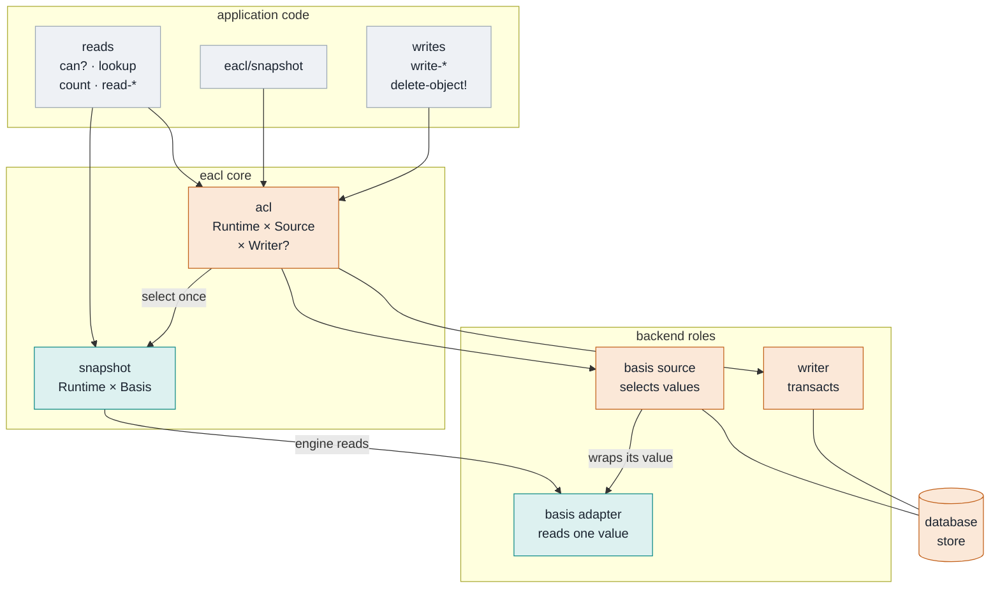
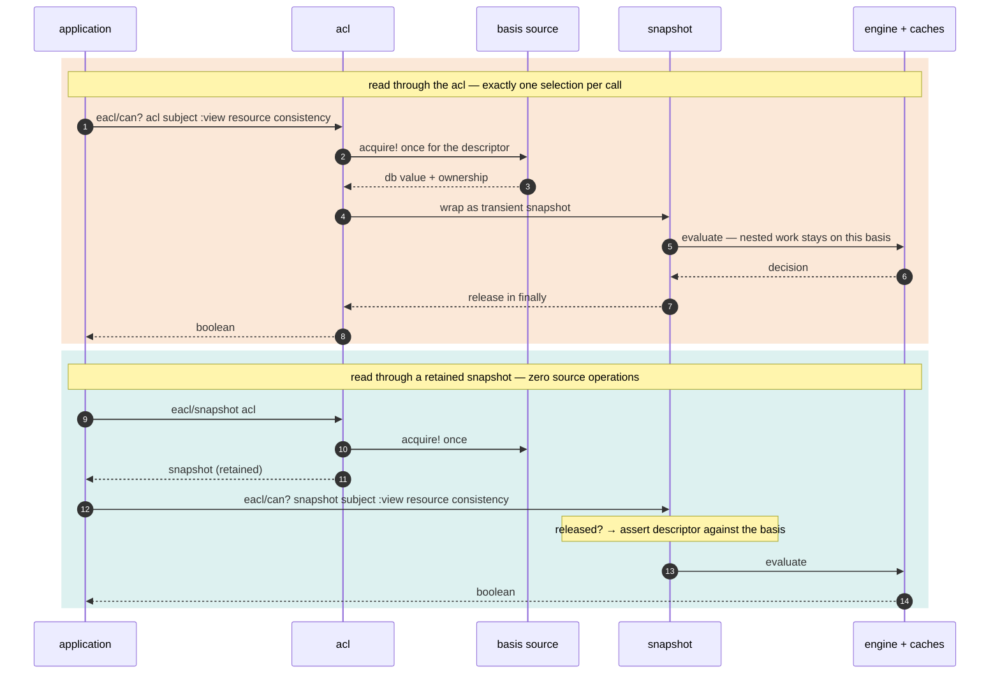
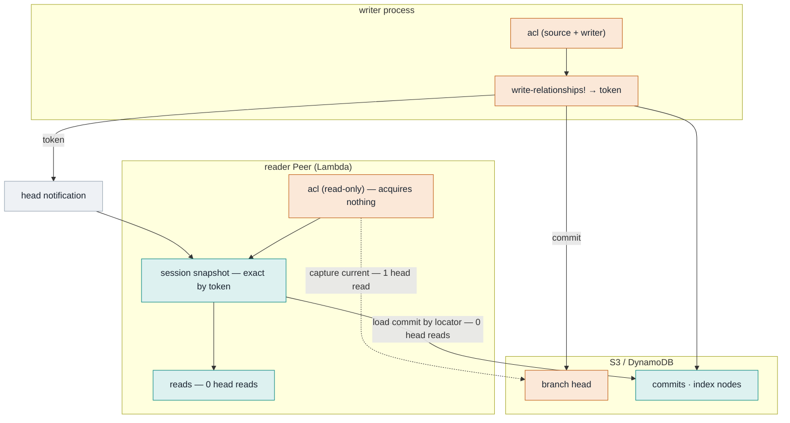
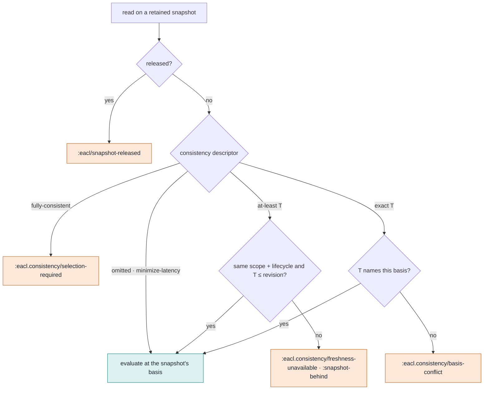
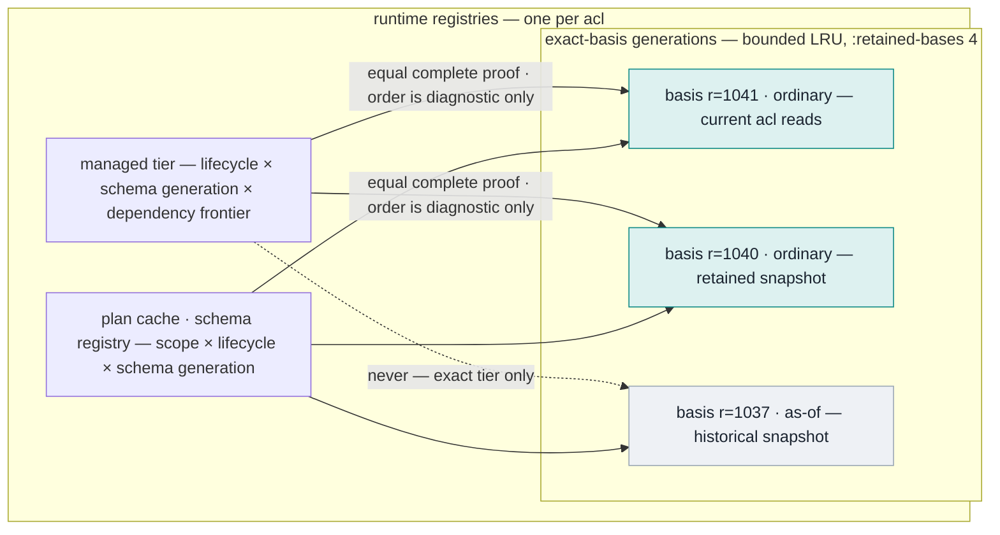

## Context

See [proposal.md](proposal.md) for motivation. The state this design starts from (the snapshot-provider work in the current tree is assumed committed before implementation):

- `eacl.core/IAuthorization` is one protocol carrying reads, writes, convenience arities, and consistency; `IDetailedAuthorization` is an optional fallback for `check-permission`. Both `eacl.client.orchestration/ClientAuthorization` and `eacl.datomic.core/Spiceomic` implement them, as does the out-of-tree `eacl-spicedb` adapter.
- The shared orchestration already selects one immutable snapshot per public read through `eacl.backend.snapshot-provider` (`acquire-current!`/`-authoritative!`/`-at-least!`/`-exact!`, borrowed/owned ownership, idempotent `release!`, owner-thread constraints, closed semantic identity). That provider is the germ of the **basis source** role below; its selected-snapshot value is the germ of the public **snapshot**.
- `eacl.backend.v8` still requires `:select-current`, `:select-authoritative`, `:select-at-least`, `:select-exact`, and `:source-lifecycle` on every *immutable* adapter, and every backend's `snapshot-adapter` closes over `conn` from the client option map. An adapter built for one database value can therefore find another one, and raw-db evaluation through a client's `opts` still reaches the connection during cursor recovery.
- `source-lifecycle` is never derivable from a database value: it is read from the client's `:source-lifecycle-state` atom, from `:source-lifecycle` config, or minted randomly per adapter. A random default means a reader process can never accept a writer process's tokens without configuration.
- The cache has nine stores. Two are basis-keyed answer tiers with different retention models (an exact-current tier holding one monotone "live" generation, and a composite-key snapshot-exact tier), one is proof-backed (managed), the `:projection` subproblem store carries no basis in its keys and is safe only because it is bound per generation, the sealed-plan cache is process-global (`defonce`) and omits the revision when a schema identity exists, and the derived-schema registry is per client. Datomic keeps a second copy of the cursor codec, page cache, and result-context capture in its own client.
- Basis-kind discrimination (`ordinary-view?`: ordinary or as-of versus filtered/since/history/speculative) exists only in the Datomic module; `raw-request-context` requires fresh, isolated context for non-ordinary values.
- Topologies this design must serve: a Datomic Peer (`d/db` is local memory; storage on DynamoDB or SQL), a non-streaming Datahike connection over Konserve/S3 where every `(d/db conn)` is a branch-head GET (measured: five GETs per warm check, one per capture, zero afterwards), an embedded Datalevin connection whose read snapshots are owned, thread-affine LMDB transactions, and DataScript on the JVM and in ClojureScript.
- Release gates: `formal-implementation-conformance` fails when a certification-relevant production branch changes without a model/ledger update; `implementation-simplicity-and-performance` ratchets a structural inventory; `public-source-closure.json` must be regenerated after public-source edits.

## Goals / Non-Goals

**Goals:**

- An immutable authorization snapshot is the primary read target; a live `acl` is a snapshot source plus an optional writer.
- One public read surface (`eacl/*`) over `acl` and snapshot; one shared execution pipeline; one cache model keyed by basis identity.
- Reading through a retained snapshot is structurally incapable of touching a connection: the value contains none.
- A reader Peer can move between bases using only authenticated tokens or database values it already holds, with zero current-head reads.
- Backend roles — basis adapter, basis source, writer — are small, separately certified, and sufficient for Datomic, Datahike, DataScript, and Datalevin without per-backend orchestration.
- The quickstart stays `make-client` plus `eacl/*` calls.

**Non-Goals:**

- Head-change notification transports (AppSync, SQS, polling) and demo deployment.
- A gRPC client or server. The reader/writer protocols stay implementable remotely; nothing more.
- Changes to schema language, authorization semantics, relationship storage, proof format, or cursor wire semantics beyond binding them to basis identity.
- Compatibility shims, dual protocols, or a migration interval.

## Architecture

Teal nodes are immutable values; amber nodes hold live authority (a connection or writer). A snapshot never touches an amber node.

### Values and roles

The runtime holds keys, limits, identity converters, the source lifecycle, and every cache registry. Its plan and derived-schema registries are keyed by `[engine ABI backend source scope lifecycle certified schema generation]`; an uncertified generation receives request-local state only. A basis is one immutable database value plus its complete identity (backend, source id, branch, source lifecycle, revision, exact locator, basis kind) and its ownership. Physical schema fingerprints, including `:schema-identity`, are not basis identity.



### Two read paths, one pipeline

After selection or retained-snapshot validation, both paths construct their private execution context through `eacl.request.context/make-context`. That constructor is the shared seam with `eliminate-authorization-request-amplification`; engine and cache code receives its context rather than a source or connection.



### Reader Peer and writer process



### Consistency on a retained snapshot is an assertion



### Caches are keyed by basis



## What changes for library consumers

| Concern | Today | After this change |
| --- | --- | --- |
| Quickstart | `make-client` + `eacl/*` | unchanged |
| Several reads at one basis | every call selects current (`N × (d/db conn)`) | `(eacl/snapshot acl)` once, then zero source operations |
| You already hold a `db` value | Datomic: engine facade without caches, cursors, or consistency; Datahike/DataScript: private `orchestration` internals | `(eacl.datomic.core/snapshot acl db)` and siblings; ordinary or as-of values only |
| Reader-only deployment | every `acl` is writable; construction reads the head on remote stores | `make-client conn {:read-only? true}`; construction acquires nothing |
| Selecting a basis from a token | only per call through the `acl` | `(eacl/snapshot acl (at-exact-snapshot token))`, zero head reads where the backend loads by locator |
| Consistency on a snapshot | n/a | an assertion: evaluates or throws `:snapshot-behind` / `:basis-conflict` / `:selection-required` |
| Tokens across processes | rejected unless `:source-lifecycle` is configured identically | accepted by the `"eacl/initial"` default on Datomic/Datahike/DataScript or Datalevin's shared persisted value; rotate explicitly on restore |
| Detailed decision | `check-permission` falls back to `can?` without `IDetailedAuthorization` | `check-permission` canonical; `can?` is its `:allowed?` |
| Writes | `acl` | `acl` only; snapshots and read-only `acl` throw `:eacl/unsupported-capability` |
| Lifecycle | none | `with-snapshot` / `release!`; no-op for borrowed bases, required for Datalevin |
| Implementing the protocols | `IAuthorization` (21 arities) + `IDetailedAuthorization` | 8 reader + 3 writer request-map methods; extensions refused with a typed error |
| Admissible values | anything, through the engine facade | ordinary and as-of; filtered/since/history/speculative refused |

```clojure
;; unchanged quickstart
(def acl (eacl.datomic.core/make-client conn {:security-key k}))
(eacl/can? acl (->user "alice") :view (->server "s1"))

;; today: N selections — after: one
(eacl/with-snapshot [snap (eacl/snapshot acl)]
  (doseq [u users] (eacl/can? snap u :view (->server "s1"))))

;; today: eacl.datomic.impl/can? db … (no caches, cursors, or consistency)
(def snap (eacl.datomic.core/snapshot acl db))
(eacl/lookup-resources snap {:resource/type :server :permission :view :subject (->user "alice") :first 20})

;; reader Peer
(def acl (eacl.datahike.core/make-client conn {:read-only? true :security-key k}))
(def session (eacl/snapshot acl (consistency/at-exact-snapshot token-from-writer)))
(eacl/can? session subject :view resource)
(eacl/can? session subject :view resource (consistency/at-least-as-fresh client-token)) ; or :snapshot-behind

(eacl/basis snap)        ; {:backend … :source-id … :branch … :source-lifecycle … :revision … :exact-locator … :basis-kind :ordinary}
(eacl/basis-token snap)  ; opaque, authenticated; valid as at-least / at-exact wherever the keyring is shared
(eacl/write-relationships! snap updates) ; => :eacl/unsupported-capability {:capability :write}
```

## Decisions

### 1. Three values: runtime, basis, snapshot; the `acl` is a source over a runtime

| Value | Contents | Lifetime |
| --- | --- | --- |
| **Runtime** | identity converters, codecs and keyring, limits, timeouts, clock, instrumentation, the lifecycle state, and every cache registry (exact-basis generations, managed tier, certified-generation-keyed plan cache and derived-schema registry, continuation and visited-page stores) | as long as the `acl` |
| **Basis** | one immutable native database value wrapped by a basis adapter, its identity `{backend source-id branch source-lifecycle revision exact-locator kind}` (explicitly excluding `:schema-identity`), ownership (`:borrowed`/`:owned`), and release state | until released or evicted |
| **Snapshot** (public) | runtime × exactly one basis | until released; transient when selected for one `acl` read |
| **Acl** (public) | runtime × basis source × optional writer | application-managed |

A snapshot holds no connection, source, writer, sync function, or history loader. That is the invariant that makes an accidental head read impossible rather than merely avoided; task 3 adds a structural test for it.

Why not store a `db` in the existing client record: the record would still carry a connection, and every code path would remain one `conn` dereference away from a head read. Why not expose runtime assembly as the primary API: `make-client` must stay the composition root for the quickstart; runtime construction is internal and per-backend constructors hide it.

For Datalevin, constructing the basis identity from an owned read snapshot uses
the maintained fork's `read-snapshot-revision-info` operation. That operation
returns only `:max-tx` and `:max-eid`; the source does not request the full
schema-bearing metadata map or derive a physical-schema fingerprint. The
paired allocation gate remains in `eliminate-authorization-request-amplification`,
while this change preserves the acquisition seam as it restructures the source.

### 2. The public name is `snapshot`, not `view`

The codebase already calls the selected immutable basis a snapshot (`snapshot-provider`, `snapshot-adapter`, `:at-exact-snapshot`), SpiceDB uses the same word, and the demo's own spec asks for a "snapshot client". `view` collides with the `:view` permission used in every README example and with Datomic's "filtered view" vocabulary that this design must use for basis kinds. The change directory keeps its historical name.

Public surface (all in `eacl.core` unless noted):

```clojure
(eacl/snapshot acl)                          ; capture current: exactly one source read
(eacl/snapshot acl consistency)              ; select by consistency descriptor
(eacl.datomic.core/snapshot acl db)          ; direct: application-owned value, zero source reads
(eacl.datahike.core/snapshot acl db)
(eacl.datascript.core/snapshot acl db)
(eacl/with-snapshot [s (eacl/snapshot acl)] ...) ; releases in finally (CLJ/CLJS macro)
(eacl/release! s) (eacl/released? s)
(eacl/basis s)                               ; bounded identity map
(eacl/basis-token s)                         ; authenticated opaque token
(eacl.datomic.core/db s)                     ; native database value accessor
(eacl/snapshot? x) (eacl/acl? x)
;; every eacl/* read accepts acl or snapshot; every eacl/* write accepts acl
```

### 3. Four small protocols; public functions normalize and dispatch

```clojure
(defprotocol IAuthorizationReader
  (-check-permission [t request]) (-read-schema [t request])
  (-read-relationships [t request]) (-lookup-resources [t request])
  (-lookup-subjects [t request]) (-count-resources [t request])
  (-count-subjects [t request]) (-expand-permission-tree [t request]))
(defprotocol IAuthorizationWriter
  (-write-schema! [t request]) (-write-relationships! [t request]) (-delete-object! [t request]))
(defprotocol ISnapshotSource
  (-snapshot [t consistency options]))
(defprotocol IAuthorizationSnapshot
  (-basis [t]) (-basis-token [t]) (-release! [t]) (-released? [t]))
```

`Snapshot` implements `IAuthorizationReader` and `IAuthorizationSnapshot`. `Acl` implements `IAuthorizationReader` (each method selects one transient snapshot and delegates), `ISnapshotSource`, and `IAuthorizationWriter` (each method throws `:eacl/unsupported-capability` when the `acl` has no writer). A remote adapter implements the reader and writer protocols directly. Public functions do exactly two things: normalize convenience arities into one request map, and dispatch to the protocol method — or throw `:eacl/invalid-authorization-target` when the value implements neither. `check-permission` is canonical; `can?` returns its `:allowed?`.

This keeps target-specific behaviour inside each record (select-then-delegate, assert-then-execute, RPC) and keeps the public functions free of branching. A single `-execute` method keyed by operation keyword was rejected because it discards arity checking and conformance discoverability.

### 4. Backend roles: basis adapter, basis source, writer

| Role | Constructed from | Operations | May hold a connection |
| --- | --- | --- | --- |
| **Basis adapter** (`eacl.backend.v8`, reduced) | one database value + conversion config | `:snapshot-id :source-scope :native-revision :order-hint :exact-locator :basis-kind :object-id->internal :internal-id->object :relation-defs :permission-defs :subject->resources :resource->subjects :direct-match? :all-permission-nodes :proof-frame` | **no** |
| **Basis source** (`eacl.backend.source`, from `snapshot-provider`) | connection/store + config | `:capabilities :execution-constraints :ownership :source-scope :acquire-current! :acquire-authoritative! :acquire-at-least! :acquire-exact! :release!` | yes |
| **Writer** (`eacl.backend.writer`) | connection + config | `:transact! :write-schema! :plan-relationship-update :plan-delete-object :relation-id :affected-relations :retraction-count :contention?` plus declared `:max-transaction-size` and `:max-attempts` | yes |

Three consequences:

- `:select-*` and `:source-lifecycle` leave the adapter. The lifecycle is runtime state and is merged into basis identity by the shared layer; the adapter never sees `opts` with a `conn` in it, so no adapter operation can reach a connection.
- A source's static profile (capabilities, scope, constraints) comes from its configuration, so **constructing an `acl` acquires no basis**. Today's provider builds a static adapter from `(d/db conn)` at construction; on a non-streaming Datahike store that is a branch-head GET before the first request.
- `:acquire-exact!` with an exact locator loads that basis directly (`d/commit-as-db` for Datahike, `d/as-of` on the local Peer for Datomic with the existing bounded targeted sync when the Peer is behind). It never first acquires current to "qualify" the request. Datahike's at-least selection keeps its bounded polling because Datahike has no `sync`.

Why not one broad map with optional operations: construction-time certification per role gives deterministic failures, lets a read-only deployment omit the writer, and makes the snapshot invariant checkable by inspecting which role an object holds.

### 5. One read pipeline

1. The public function normalizes the request (arities, defaults, `:timeout-ms`, `:cancellation-token`, `:cache?`) into one request map and dispatches.
2. `Acl`: resolve the request's consistency descriptor through the source exactly once, wrap the result as a transient `Snapshot`, run step 4, release the basis in `finally`.
3. `Snapshot`: check `released?`, validate any consistency descriptor as an assertion (Decision 6), run step 4; never release.
4. Construct the snapshot context through `eacl.request.context/make-context`, then execute against it: schema validation, engine evaluation, nested dispatch, proof frames, cache lookup and publication, pagination, cursor and token rendering all receive the same context. Engine entry points cannot name an `acl`, a source, or a connection.

The Datomic client's private copy of this pipeline is deleted (Decision 15). The raw-db entry points that take a client's `opts` map (`datahike-can?` and friends) are deleted; the direct `snapshot` constructor supersedes them.

### 6. Consistency: request-scoped on `acl`, an assertion on a snapshot

| Descriptor | On `acl` | On a retained snapshot |
| --- | --- | --- |
| omitted / `:minimize-latency` | select current | evaluate |
| `:fully-consistent` | select authoritative | `:eacl.consistency/selection-required` |
| `at-least-as-fresh T` | select at-least `T` | evaluate if `revision(snapshot) >= T` in the same scope and lifecycle; else `:eacl.consistency/freshness-unavailable` with `:reason :snapshot-behind` |
| `at-exact-snapshot T` | select exact `T` | evaluate if `T` names this basis; else `:eacl.consistency/basis-conflict` |

Assertions are validated before cache access, against the token's authenticated scope. A retained snapshot never advances; an `acl` never remains pinned. Selecting a snapshot with `:fully-consistent` and then passing `:fully-consistent` to reads of that snapshot is an error by design: the descriptor requests authority the value cannot establish, and the documentation says so. The recommended pattern when an assertion fails is to select a new snapshot through the `acl` (Decision 13).

### 7. Basis kinds decide admission and cache class

Every basis adapter reports `:basis-kind`:

| Kind | Example | Public snapshot admission | Cache class |
| --- | --- | --- | --- |
| `:ordinary` | `(d/db conn)`, a captured value, `d/commit-as-db` | admitted | ordinary: exact tier + managed lifting |
| `:as-of` | `(d/as-of db t)`, Datahike `AsOfDB` | admitted | historical: exact tier only |
| `:filtered` `:since` `:history` `:speculative` | `d/filter`, `d/since`, `d/history`, `d/with` | **refused** (`:eacl/unsupported-database-value`) | engine facade only, isolated context |

Filtered, since, history, and speculative values report the same source, revision, and schema stamp as the plain value they wrap; no identity derived from them can be complete, so nothing keyed by identity may admit them. An `:as-of` basis is identified by source scope, lifecycle, its as-of revision, and its kind; an exact locator is optional for it, because the kind already separates it from the ordinary value at the same revision. Datomic's `ordinary-view?` becomes the adapter obligation `:basis-kind #{:complete-identity}` every backend certifies. Speculative evaluation stays available through `eacl.datomic.impl` and `eacl.engine.v8` with the request-scoped isolation `raw-request-context` already requires.

### 8. A basis-first cache model

- **One exact-basis tier.** Completed answers are keyed by complete basis identity (backend, source scope, lifecycle, revision, exact locator, basis kind, adapter fingerprint, identity contract, engine/order ABI) plus the semantic request. The runtime retains a bounded LRU of **basis generations** (default `:retained-bases 4`); each generation owns that basis's exact answers and its subproblem/projection store. This replaces the monotone exact-current generation and the separate snapshot-exact tier: with retained snapshots several bases are live at once, so "the" current generation no longer exists.
- **Per-basis subproblem stores.** Projection and direct-match keys carry no basis, so they live in the basis generation and are never shared across bases.
- **Managed lifting by class and lineage.** A managed (proof-backed) answer computed at basis `E` may answer a request at basis `S` iff `S` is ordinary class, `S` and `E` share source scope and lifecycle, and schema generation and scalar dependency frontier are equal. No revision comparison is made: `EqualScalarProofPreservesEveryDeterministicDenotation` (`ScalarFrontierCoherence.dfy`) is an equality over both endpoints of one history, and its older-selected form `EqualScalarProofAlsoPreservesAnOlderSelectedSnapshot` (line 858) is already proved, so an entry computed at a newer basis serves an older retained snapshot of the same lineage exactly as the reverse — the case that matters for a reader Peer holding a session snapshot behind the writer. The rule does not depend on how `S` was selected. Historical-class bases use the exact tier only in this change; `introduce-proof-carrying-semantic-equivalence` relaxes that to frame readability once Datomic retains stamp history.
- **Runtime-owned registries.** The sealed-plan cache and derived-schema registry become runtime-owned and keyed by `[engine ABI backend source scope lifecycle certified schema generation]`. An uncertified generation uses the request-local floor from `eacl.request.context/make-context` and publishes nothing cross-request. Nothing is process-global, so two `acl`s over different sources cannot alias plans and rotation has one owner.
- **Continuation and visited-page stores** remain keyed by exact basis and authenticated query scope.

### 9. Cursors continue on the basis that minted them

A cursor binds its basis identity, query scope, plan fingerprint, and boundary. Consumption dispatches on the target:

- same snapshot → continue directly;
- `acl` → the existing continuation decision: equal proof on the selected basis continues; otherwise exact reconstruction through the source's `:acquire-exact!` when supported, else the existing typed stale/unavailable errors;
- a different snapshot → continue only when the managed lifting rule admits the cursor's proof at that basis; otherwise `:eacl.consistency/basis-conflict` with `:source :cursor`. No hidden source acquisition.

### 10. One write pipeline

`Acl` writes: acquire one current planning basis from the source, plan the transaction against it (endpoint guards, relation stamps, schema fence), submit through the writer, derive the response token from `db-after` with the adapter, release the planning basis. When the writer classifies a failure as contention, the pipeline re-plans on a fresh current basis up to the writer's declared `:max-attempts` and then throws `:eacl/relationship-contention`. Object deletion respects the writer's declared `:max-transaction-size` by batching. Datomic's CAS loop and thousand-row batches become declarations, not a second pipeline. Snapshots implement no writer protocol; a read-only `acl` (`make-client conn {:read-only? true}`) has no writer and its writer methods throw `:eacl/unsupported-capability` before planning.

### 11. Lifecycle and execution constraints

- Transient snapshots (one `acl` read) are released in `finally`.
- Retained snapshots are released by `eacl/release!` or `with-snapshot`; release is idempotent and guarded by shared release state; borrowed bases (Datomic, Datahike, DataScript) release nothing native; owned bases (Datalevin) release exactly once.
- Any read after release throws `:eacl/snapshot-released` before touching the adapter or runtime.
- A source declares execution constraints; a snapshot over an owned thread-affine basis may only be read and released on its acquiring platform thread, and violations fail typed before backend work. Documentation states that retaining an owned snapshot holds the native read transaction open.
- Correctness never depends on garbage collection or `Closeable`, which is not portable to ClojureScript.

### 12. Lifecycle identity has a constant default; rotation is explicit

The default `:source-lifecycle` is the documented constant `"eacl/initial"` on Datomic, Datahike, and DataScript instead of a random per-client UUID. Tokens and cursors then round-trip between reader and writer processes with no configuration, which is the normal deployment shape for a reader Peer. Datalevin is deliberately exempt: its constructor requires an explicitly supplied persisted lifecycle shared by every process for that source. `expire-cache!` still rotates to a fresh UUID (or a supplied coordinated value), clears every runtime registry, and is the required operator action on restore, reset, branch force, or history replacement — exactly as `backend-native-revision-consistency` already demands. A random default never protected an unrotated process; it only isolated processes from each other by accident. After rotation a retained snapshot keeps evaluating correctly at its immutable value, but its tokens and cursors are scoped to the old lifecycle and its basis generation is no longer reachable from the runtime.

### 13. Cross-process basis exchange: the reader Peer pattern

```clojure
;; writer process
(def token (:zed/token (eacl/write-relationships! writer-acl updates)))
(publish! token)                                   ; any transport; out of scope

;; reader Peer (Lambda); cold start
(def conn (d/connect cfg))                          ; one branch-head read, outside EACL
(def acl (eacl.datahike.core/make-client conn {:read-only? true :security-key k}))  ; acquires nothing

;; on notification
(def session (eacl/snapshot acl (consistency/at-exact-snapshot token)))   ; zero branch-head reads

;; per request
(eacl/can? session subject :view resource)          ; zero source operations
(eacl/lookup-resources session {... :consistency (consistency/at-least-as-fresh client-token)})
;; => evaluates when the session satisfies the floor, else :snapshot-behind → select a newer session
```

The token carries `{:backend :source-id :branch :source-lifecycle :revision :exact-locator}` and is authenticated with the shared keyring; a foreign or tampered token fails before any selection. No `acl` state is involved: the "candidate basis" lives in the application as a retained snapshot, which is why the `acl` stores no selected basis and no consistency policy.

### 14. SpiceDB shape without overclaiming

`check-permission`, `read-schema`, `read-relationships` (forward pagination), `lookup-resources`, `lookup-subjects`, `expand-permission-tree`, `write-schema!`, and `write-relationships!` keep SpiceDB-shaped request and response maps and request-scoped consistency. `count-resources`, `count-subjects`, backward pagination, `delete-object!`, snapshots, basis metadata, and native accessors are EACL extensions. A remote adapter implements the reader and writer protocols, may emulate an extension client-side, and otherwise refuses it with `:eacl/unsupported-capability`. Refusal with a typed error is honest capability reporting; `AbstractMethodError` or a missing method is not.

### 15. Datomic converges on the shared orchestration

Datomic provides a basis adapter (with `:basis-kind`), a borrowed basis source (`d/db`, bounded `d/sync`, `d/as-of`, targeted catch-up), and a writer (CAS-guarded relationship transactions, schema fence, relation stamps, `:eacl.fn/assert-relation-unused`, contention classification of `:db.error/cas-failed`, `:max-attempts 8`, `:max-transaction-size 1000`). `Spiceomic`, `execute-request`, the `eacl4_` page-token codec, the private page cache, result-context capture, and duplicated `expire-cache!`/`cache-stats` are deleted. `eacl.datomic.impl` remains the engine facade used by op-count, plan-isolation, and differential suites. The revision-equals-locator invariant and `validate-exact-token!` move into the Datomic source.

### 16. Error taxonomy

| Condition | `:type` / `:eacl/error` |
| --- | --- |
| value is neither reader nor source | `:eacl/invalid-authorization-target` |
| write on snapshot or read-only `acl`; `snapshot` on a snapshot; exact selection on a source without it; remote extension refusal | `:eacl/unsupported-capability` with `:capability` and `:target` |
| database value of an inadmissible kind, another backend, or another source | `:eacl/unsupported-database-value` with `:basis-kind` |
| read or release after release | `:eacl/snapshot-released` |
| `:fully-consistent` on a snapshot | `:eacl.consistency/selection-required` |
| at-least floor newer than the snapshot | `:eacl.consistency/freshness-unavailable`, `:reason :snapshot-behind`, bounded requested/actual revisions |
| exact token or cursor names another basis | `:eacl.consistency/basis-conflict` with `:source :token` or `:cursor` |
| thread-affinity violation | the source's existing execution-constraint error |

Every typed error carries both `:type` and `:eacl/error`; the Datomic module's partially dual-keyed errors are normalized as part of convergence.

### 17. Assurance obligations are part of the change

The adapter-obligation map that documents `SnapshotOracle.dfy`'s assumptions is split by role; `execution-contract.edn`'s production map gains the `Acl`/`Snapshot` entry points and loses `eacl.datomic.core/execute-request`; `implementation-simplicity.edn` records the added branches (target dispatch, snapshot assertions, lifecycle) against the removed mechanisms (Datomic's duplicate orchestration and cursor codec, the monotone exact-current generation, the DataScript special case in selection, the `IDetailedAuthorization` fallback); `production-decision-inventory.md`, `assurance-matrix.edn`, and `public-source-closure.json` are regenerated. The lifting rule in Decision 8 is checked against `EqualScalarProofPreservesEveryDeterministicDenotation` and `EqualScalarProofAlsoPreservesAnOlderSelectedSnapshot` in `ScalarFrontierCoherence.dfy`, and the assurance matrix cites both.

## Risks / Trade-offs

- **[Datomic convergence is the largest single item]** → it is a separable phase (tasks §10); everything before it is complete and useful without it, and its suites (characterization, op-count, plan isolation, differential, trusted surface) stay green against the engine facade throughout.
- **[Bounded retained bases change eviction behaviour]** → default of four bases with the existing byte/weight bounds; a retained snapshot whose generation was evicted recomputes and re-publishes, never errors.
- **[Constant default lifecycle changes test isolation]** → Datomic, Datahike, and DataScript tests that relied on two clients over one database having distinct random lifecycles pass an explicit `:source-lifecycle`; Datalevin retains its required persisted value.
- **[Owned snapshots retained too long]** → documented, thread-affine, explicit release, `with-snapshot`; Datalevin may additionally declare a maximum retention and fail closed.
- **[Structural inventory may grow]** → the removed mechanisms in Decision 17 offset the additions; the gate is run before the Datomic phase and again after it.
- **[`eacl-spicedb` must be recut]** → its change is sequenced after this one and pins the next development artifact; until then it stays on the current SHA.
- **[Exact-by-locator semantics differ per backend]** → Datomic keeps targeted sync when behind; Datahike loads the commit and reports unavailable when collected; DataScript refuses; all are typed and certified by the shared suite.
