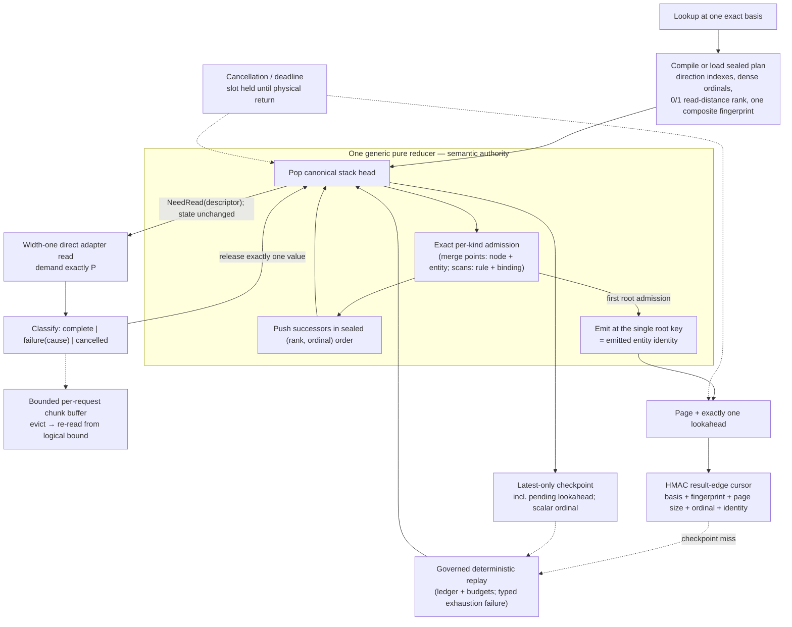

# Stable Discovery Engine Handover

## Status at handover

The planning artifacts are complete and have been **revised** (task 1.9): this change now specifies a strictly smaller engine than the earlier draft — one generic reducer, width-one-only physical execution, two cache artifacts, three-outcome adapter results — with a re-sequenced delivery plan that routes the public API after local gates and defers remote performance qualification to follow-on work. Implementation has not started: 9 of 61 tasks are complete, all in exploration and decision recording.

Read these three warnings before touching source:

1. **Everything named "stable-discovery" in `src` is the rejected candidate.** `portable_indexed.cljc`'s `:stable-discovery` mode, the prefix commitments, order ABI 3, `StableDiscovery.dfy`, the physical scheduler, and the cross-request shared-read machinery implement the formally and empirically rejected symmetric byte-stable design. None of it is a porting source for the accepted engine.
2. **The accepted engine's only implementation is the archived prototype.** The prototype (`forward_runtime_prototype.clj`), the 43 Dafny leaves/536 obligations, five TLA+ families, and every benchmark protocol are archived read-only under `exploration/stable-discovery/` (task 2.1, complete — see its `ARCHIVE.md` for what was excluded). The live working copies under gitignored `target/exploration/` remain usable for re-running gates but are no longer the only copy.
3. **The prototype's default logical chunk width is 64 — a rejected configuration.** All order evidence is valid only with logical release pinned to one value. Production hard-fixes it; a mutant control guards it.

Confidence is **high** in the abstract semantic architecture (proved and adversarially re-reviewed), **moderate** in projected production performance (kernel-scale numbers are excellent; the end-to-end public path has never been measured), and **moderate** in delivery risk (the plan now has explicit local gates and an honest deletion/rollback story). Remote topology performance is deliberately not a release gate; it gates deployment claims and Datahike/DynamoDB enablement.

## Authoritative artifacts

- [Proposal](proposal.md) — motivation, scope, what was cut from the earlier draft and why.
- [Design](design.md) — the accepted architecture, evidence, all thirteen decisions, risks, delivery sequence.
- [Stable discovery specification](specs/stable-discovery-enumeration/spec.md) — order, admission, uniqueness by construction, cursors, pagination, continuation, consistency rules, counts.
- [Bounded physical execution specification](specs/bounded-physical-execution/spec.md) — width-one execution, three-outcome results, chunk retention, cancellation, checkpoints, the two cache artifacts, representation contract.
- [Remote backend efficiency specification](specs/remote-backend-enumeration-efficiency/spec.md) — capability certification, telemetry, local-first qualification, benchmark matrix.
- [Assurance coverage](ASSURANCE_COVERAGE.md) — every requirement mapped to evidence and its remaining transfer gate.
- [Implementation tasks](tasks.md) — ordered delivery with stop gates.

The exploration corpus (contracts, audits, benchmark protocols, prototype) is archived at `exploration/stable-discovery/` (indexed by its `README.md`); the deployment investigation lives in `eacl-datahike-demo/docs/`.

## Architecture at a glance

The pure-step/`NeedRead` boundary is the preserved seam for a future concurrency change; its models (`ReducerReadAhead.tla`, `DescriptorCoalescing.tla`, `WeightedResponseLease.dfy`, `ServiceLifecycle.tla`) are parked, not deleted.

## Previous designs versus the accepted engine

| Concern | Global EID merge | Rejected symmetric/byte candidate | Accepted engine (this revision) |
|---|---|---|---|
| First result | Must realize every stream head (2,002 scans on the adversarial fixture; 4,536 scans / 148.4 s cold on the deployed 1M-resource store) | Byte-ordered DFS can pick arbitrarily expensive empty branches (2,033 scans, ~203 MiB, same fixture) | Cost-ranked DFS follows the cheapest certified path (1 scan, same fixture) |
| Recursive state | N stream cursors + merge | Dynamic grant/consumer buckets, join cursors, emitted set | One stack + one exact per-kind admission set against static plan indexes |
| Deduplication | Merge uniqueness | Emitted-result history | Root admission keyed by emitted entity — uniqueness by construction |
| Cursor | Entity-ID boundary | Rolling per-result prefix commitments | One HMAC edge token; commitment proved redundant |
| Physical execution | Serial, order-coupled | Speculative shell + cross-request sharing | Width one, direct path; concurrency is a future seam |
| Caches | — | Four tiers | Two artifacts: latest checkpoint + completed answer |

## Exact next steps

Follow [tasks.md](tasks.md) in order. The critical sequence:

1. **Archive the evidence (2.1) before anything else.**
2. Freeze reproducible baselines against the current engines (2.2–2.5); they are the differential oracles and, after deletion, the only ones.
3. Promote retained assurance; park the concurrency models; land the new mutant controls (3.x).
4. Build sealed planning and the generic reducer as a port of the prototype with logical width one (4.x–5.x). Stop if CLJ/CLJS bridges cannot establish plan order, rank, denotation, termination, uniqueness, and the concrete trace.
5. Build pagination, checkpoints (with the lookahead segment), consistency-aware continuation, and the typed exhaustion failure (6.x).
6. Build the width-one physical layer: result classification with cause codes, the `select-exact` repair, chunk retention, service-edge admission with slot-hold (7.x).
7. Build the point-check and count routes and settle `:complete-denotation` **before** any deletion; pass the binding local gates on CLJ and CLJS with fault injection (8.x).
8. Route all five entry points, then delete the old engines and the rejected candidate in one gated step (9.x).
9. Remote performance qualification (10.x) follows routing and publishes deployment guidance; it opens the separate concurrency change only if measurements justify it.

## Do not silently reintroduce

- global entity-ID order or any global N-way merge;
- runtime latency, cache state, or byte comparison as an ordering input;
- eager multi-value semantic admission of a physical chunk (any logical release width other than one);
- probabilistic duplicate suppression;
- dynamic symmetric join buckets, joined-pair history, or a separate emitted-result set;
- rolling prefix commitments;
- entity-only admission keys for interior work, or producing-edge keys at the root;
- a generated-code runtime authority or host-side recomputation twin for the new engine;
- speculative physical execution, descriptor coalescing, or cross-request in-flight sharing inside this change;
- projection or denotation cache tiers in the engine;
- `nil` or missing-node responses interpreted as legitimate empty scans;
- silently serving a cursor continuation that violates the request's consistency mode, or continuing on a changed basis without the certified full-read-scope proof.
