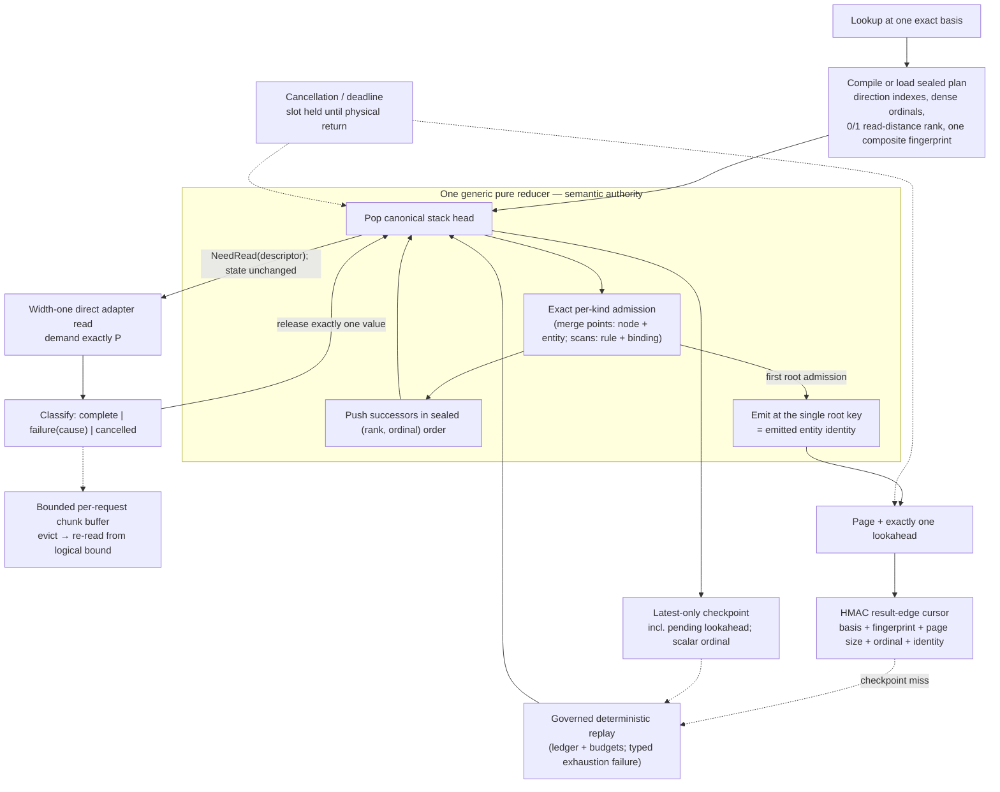

# Stable Discovery Engine Handover

## Status at handover

The planning artifacts are complete and have been **revised** (task 1.9): this change now specifies a strictly smaller engine than the earlier draft — one generic reducer, width-one-only physical execution, two cache artifacts, three-outcome adapter results — with a re-sequenced delivery plan that routes the public API after local gates and defers remote performance qualification to follow-on work. Implementation is live: 44 of 61 tasks are complete and the stable engine is the routed public engine (see Exact next steps for the current release state).

Read these three warnings before touching source:

1. **Everything named "stable-discovery" in `src` is the rejected candidate.** `portable_indexed.cljc`'s `:stable-discovery` mode, the prefix commitments, order ABI 3, `StableDiscovery.dfy`, the physical scheduler, and the cross-request shared-read machinery implement the formally and empirically rejected symmetric byte-stable design. None of it is a porting source for the accepted engine.
2. **The accepted engine's only implementation is the archived prototype.** The prototype (`forward_runtime_prototype.clj`), the 43 Dafny leaves/536 obligations, five TLA+ families, and every benchmark protocol are archived read-only under `exploration/stable-discovery/` (task 2.1, complete — see its `ARCHIVE.md` for what was excluded). The live working copies under gitignored `target/exploration/` remain usable for re-running gates but are no longer the only copy.
3. **The prototype's default logical chunk width is 64 — a rejected configuration.** All order evidence is valid only with logical release pinned to one value. Production hard-fixes it; a mutant control guards it.

Confidence is **high** in the abstract semantic architecture (proved and adversarially re-reviewed), **moderate** in projected production performance (kernel-scale numbers are excellent; the end-to-end public path has never been measured), and **moderate** in delivery risk (the plan now has explicit local gates and an honest deletion/rollback story). Remote topology performance is deliberately not a release gate; it gates deployment claims and Datahike/DynamoDB enablement.

## Authoritative artifacts

- [Proposal](proposal.md) — motivation, scope, what was cut from the earlier draft and why.
- [Design](design.md) — the accepted architecture, evidence, all thirteen decisions, risks, delivery sequence.
- [Stable discovery specification](specs/stable-discovery-enumeration/spec.md) — order, admission, uniqueness by construction, cursors, pagination, continuation, consistency rules, counts.
- [Bounded physical execution specification](specs/bounded-physical-execution/spec.md) — width-one execution, three-outcome results, chunk retention, cancellation, checkpoints, the two cache artifacts, representation contract.
- [Remote backend efficiency specification](specs/remote-backend-enumeration-efficiency/spec.md) — capability certification, telemetry, local-first qualification, benchmark matrix.
- [Assurance coverage](ASSURANCE_COVERAGE.md) — every requirement mapped to evidence and its remaining transfer gate.
- [Implementation tasks](tasks.md) — ordered delivery with stop gates.

The exploration corpus (contracts, audits, benchmark protocols, prototype) is archived at `exploration/stable-discovery/` (indexed by its `README.md`); the deployment investigation lives in `eacl-datahike-demo/docs/`.

## Architecture at a glance

The pure-step/`NeedRead` boundary is the preserved seam for a future concurrency change; its models (`ReducerReadAhead.tla`, `DescriptorCoalescing.tla`, `WeightedResponseLease.dfy`, `ServiceLifecycle.tla`) are parked, not deleted.

## Previous designs versus the accepted engine

| Concern | Global EID merge | Rejected symmetric/byte candidate | Accepted engine (this revision) |
|---|---|---|---|
| First result | Must realize every stream head (2,002 scans on the adversarial fixture; 4,536 scans / 148.4 s cold on the deployed 1M-resource store) | Byte-ordered DFS can pick arbitrarily expensive empty branches (2,033 scans, ~203 MiB, same fixture) | Cost-ranked DFS follows the cheapest certified path (1 scan, same fixture) |
| Recursive state | N stream cursors + merge | Dynamic grant/consumer buckets, join cursors, emitted set | One stack + one exact per-kind admission set against static plan indexes |
| Deduplication | Merge uniqueness | Emitted-result history | Root admission keyed by emitted entity — uniqueness by construction |
| Cursor | Entity-ID boundary | Rolling per-result prefix commitments | One HMAC edge token; commitment proved redundant |
| Physical execution | Serial, order-coupled | Speculative shell + cross-request sharing | Width one, direct path; concurrency is a future seam |
| Caches | — | Four tiers | Two artifacts: latest checkpoint + completed answer |

## Exact next steps

State at 2026-08-14 (end of session): **the stable engine is the public
engine, operator-hardened, and the dead paths are gone.** Beyond the
routing flip, this session repaired the operator-reported cache layers
(client continuation-context checkpoints, source-identity plan cache, the
Datomic client's `:stable-edge` answer-cache validator), restored
execution enforcement (timeouts/cancellation were inert on the routed
engine), corrected the public limit mapping (`:max-queued-work` bounds
instantaneous queue depth via new `:max-stack`; `:max-advanced-datoms`
bounds consumed values via new `:max-values`; internal ceilings scale
with authorized work), restored the recursive bare-`:last` guard (sealed
plans carry `:recursive?`), pinned public error shapes (limits =
`{:eacl/error :limit-kind :limit}`; stale cursors = minimal
`{:eacl/error}`), and executed task 9.2 (`v8.cljc` 4,956 -> 1,354 lines;
`:relation-populated?` out of the adapter contract; verified-authority
suite re-pinned to the four live generated decisions). Local MinIO
qualification at 100k servers: cold first page **5 GETs / 126 ms** (was
3,935 GETs / 148.4 s), exhaustive count 3,062 GETs / 8.6 s cold and
0 GETs / 16 ms cached, evicted-checkpoint replay **13 GETs / 178 ms**.
Verified locally: CI-equivalent battery ~26k assertions, formal smoke
~15.6k, verified-authority heavy + nonbenchmark (36k assertions,
four-operation coverage on all three backends), CLJS bundle.

Next, in order:

1. **Watch CI on `v8.0.0-SNAPSHOT` (`c6a10d0`)** — Tests + Formal gate
   the CI-side Clojars publish. Every previously diagnosed failure class
   is fixed and verified locally; on a new failure,
   `gh run view <id> --log-failed`, fix, re-merge, re-push.
2. **Deploy `eacl-datahike-demo` to demo.eacl.dev** on publish:
   `infra/deployment.env` exists (host `demo.eacl.dev`, key
   `~/.ssh/id_rsa`, SSH verified); clear `~/.m2/repository/dev/eacl`;
   `npm run build` (uberjar embeds resolved artifact SHAs);
   `infra/scripts/deploy-artifact.sh demo.eacl.dev ~/.ssh/id_rsa`;
   smoke `/api/health` + a super-user page. Do **not** reseed S3. The
   demo repo carries the prewarm removal + raised traversal limits —
   deploy from that tree and push its commits.
3. **The remaining formal cut** (one scoped commit): retired Dafny
   leaves (`AcyclicEngine`, `Indexed*` x10, `OrderedMerge`,
   `CursorCost`), their generated indexed runtime,
   `IndexedTraversalKernel` + implementations, indexed bridge-test
   sections, `manifest.edn` re-pins, and the leftover `^:benchmark`
   rebase. See "Known issues" in `tasks.md` for the full inventory.
4. **9.3 tail** (`normalize-page-request`'s `:relationship-page`
   decision de-authority with exhaustive-domain bridges), then CLJS
   parity halves (2.4/3.3/4.5/5.5/8.5) and 8.6 containerized fault
   injection.
5. **Section 10 remote qualification** on the deployed demo (S3 GET
   verification at 1M: enable S3 request metrics on the bucket or read
   Datahike's `:reads` counter — production CloudWatch has no request
   metrics today; local MinIO numbers above are the baseline).

Operational notes that save time: run the CI-equivalent battery with
`clojure -X:dev:test :excludes '[:benchmark :formal-artifact]'` (the
isolated-module pattern misses most of the aggregate surface); regenerate
`formal/verification/public-source-closure.json` after ANY public-source
edit; the cross-runtime page order lives in
`formal/cross-runtime/vectors.edn` AND is content-pinned by
EACL-FORMAL-059 — update both together; distinct stores must carry
distinct source lifecycles (fixtures included) or identity-keyed caches
alias.

## Do not silently reintroduce

- global entity-ID order or any global N-way merge;
- runtime latency, cache state, or byte comparison as an ordering input;
- eager multi-value semantic admission of a physical chunk (any logical release width other than one);
- probabilistic duplicate suppression;
- dynamic symmetric join buckets, joined-pair history, or a separate emitted-result set;
- rolling prefix commitments;
- entity-only admission keys for interior work, or producing-edge keys at the root;
- a generated-code runtime authority or host-side recomputation twin for the new engine;
- speculative physical execution, descriptor coalescing, or cross-request in-flight sharing inside this change;
- projection or denotation cache tiers in the engine;
- `nil` or missing-node responses interpreted as legitimate empty scans;
- silently serving a cursor continuation that violates the request's consistency mode, or continuing on a changed basis without the certified full-read-scope proof.
